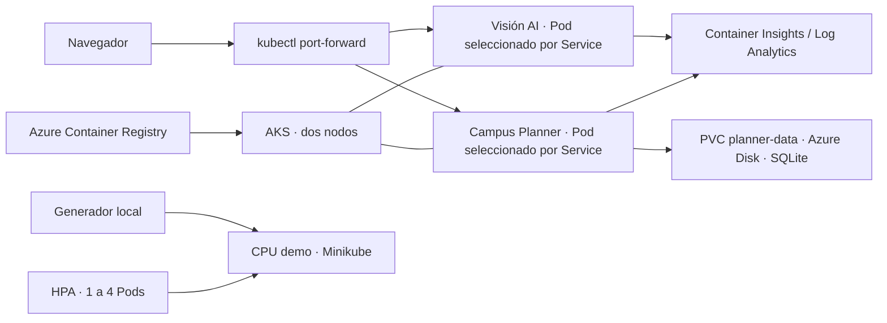

# Microproyecto 2 · Kubernetes en Azure AKS

Dos aplicaciones en contenedores, almacenamiento persistente y monitoreo en Azure, con una demostración adicional de escalado automático HPA en Minikube.

**Computación en la Nube · Universidad Autónoma de Occidente**

## Integrantes

- **JUAN OSPINA TENORIO**
- **MIGUEL ANGEL DIUZA**
- **NATALIA HERNANDEZ PIEDRAHITA**

[Equipo, atribuciones y fuentes](docs/EQUIPO.md).

## Qué se construyó

**Visión AI:** aplicación Flask que analiza una fotografía con PyTorch y MobileNetV3 Small preentrenado en ImageNet-1K. Devuelve las cinco categorías con mayor puntuación, tiempo de inferencia y Pod que atendió la solicitud. No entrena el modelo ni conserva las fotografías.

**Campus Planner:** tablero de actividades académicas con creación, consulta, actualización y eliminación. Guarda las tareas en SQLite; en AKS, el archivo reside en un Azure Disk solicitado mediante un PVC.

**Laboratorio HPA:** aplicación de carga de CPU, generador de solicitudes y HorizontalPodAutoscaler en un clúster Minikube separado. Demuestra aumento automático de una a cuatro réplicas y retorno a una al retirar la carga.

## Estado y cumplimiento

Última ejecución funcional: **14 de septiembre de 2026, hora de Colombia**; algunos registros llevan fecha **15 de septiembre en UTC**. El cierre posterior confirmó **AKS Stopped / Succeeded**, máquinas del grupo con capacidad cero y disco conservado. Minikube y Docker Desktop quedaron detenidos. Las páginas necesitan reactivación; GitHub aloja el código, no los servicios.

| Punto de la actividad | Implementación | Evidencia y demostración |
|---|---|---|
| AKS creado desde Portal, mínimo dos nodos | AKS en Chile Central, dos nodos Linux | Cloud Shell comprobado el 9/09; CLI local repetida el 14/09. [Evidencias](evidencias/README.md) |
| Clasificador de imágenes en AKS | Flask, PyTorch y MobileNetV3 Small; dos réplicas | Inferencia real y pruebas de entradas correctas e inválidas |
| Otra aplicación en AKS | Campus Planner con Flask y SQLite; una réplica | CRUD y tarea conservada tras reemplazar el Pod usando el mismo PVC |
| Monitoreo con servicios de Azure | Container Insights, Log Analytics y consultas KQL | Solicitudes reales consultadas; CPU/memoria y eventos del clúster |
| Sustentación individual | Guion por requisito y preguntas con respuestas | [Demostración paso a paso](docs/08-REACTIVACION-Y-DEMO.md) y [ensayo](docs/09-ENSAYO-PREGUNTAS.md) |
| Extra elegido: HPA (+0,5 según el enunciado) | Minikube local, metrics-server y HPA | Ciclo automático **1 → 4 → 1** registrado. Kubeflow no fue la opción elegida |

La calificación y la confirmación de entrega corresponden al curso. Los resultados registrados y sus límites están en [RESULTADOS.md](docs/RESULTADOS.md).

## Arquitectura



Los nodos son máquinas; las réplicas son Pods. El túnel selecciona un Pod del Service y no prueba balanceo entre réplicas. La ubicación real se consulta con `kubectl get pods -o wide`.

## Abrir el proyecto existente en AKS

Requisitos: Git, Azure CLI, kubectl, Python 3 y acceso autorizado a la suscripción y al clúster existentes. Docker no es necesario para abrir las aplicaciones ya desplegadas en AKS.

```bash
git clone https://github.com/nathernandez1189/microproyecto2-aks.git
cd microproyecto2-aks
# Solo en una copia nueva: crear .env y completar los valores propios.
cp -n .env.example .env
export AZURE_CONFIG_DIR="$PWD/.azure"
export KUBECONFIG="$PWD/.kube/aks.config"
az login
bash scripts/13-start-aks.sh
bash scripts/01-connect.sh cli-local
bash scripts/04-open-apps.sh
```

Si trabajas en la carpeta original, entra en ella y conserva su `.env`; no clones encima. El inicio reanuda el clúster existente y vuelve a consumir recursos de Azure. Deja abierta la terminal de los túneles:

- Visión AI: [http://localhost:8081/](http://localhost:8081/)
- Campus Planner: [http://localhost:8082/](http://localhost:8082/)

En otra terminal, desde el proyecto:

```bash
bash scripts/11-test-aks.sh
python3 scripts/12-query-monitoring.py
```

La prueba HTTP incluye operaciones sobre datos de prueba y reinicia el Deployment de Planner para verificar persistencia. Puede ser necesario volver a abrir su túnel. El primer despliegue en una suscripción nueva se explica en [02-AZURE.md](docs/02-AZURE.md); no se crea otro clúster para cada ensayo.

## Ejecutar las aplicaciones solo en Docker

Con Docker funcionando, desde el proyecto y sin los túneles anteriores ocupando los mismos puertos:

```bash
docker compose up -d --build --wait
docker compose ps
python3 -m unittest discover -s tests -v
```

Usa las mismas direcciones 8081/8082. Esta ejecución es local y no demuestra AKS. Para detener conservando el volumen: `docker compose stop`.

## Demostrar el extra HPA local

Requiere Docker, Minikube y kubectl. Los scripts usan un perfil y una configuración separados de AKS.

```bash
bash scripts/08-hpa-local.sh
bash scripts/14-reset-hpa-load.sh
bash scripts/09-verify-hpa.sh
```

El script 14 renueva únicamente el Job generador, que puede haber vencido tras una sesión anterior. El script 09 inicia carga, observa cuatro réplicas disponibles, suspende la carga y espera una. No utiliza `kubectl scale` para simular el resultado. [Conceptos, comandos y diagnóstico HPA](docs/04-HPA.md).

## Documentación

| Archivo | Contenido |
|---|---|
| [01-INICIO](docs/01-INICIO.md) | Rutas de primera ejecución y ensayo |
| [02-AZURE](docs/02-AZURE.md) | Cuenta, cuotas, creación por Portal, ACR y despliegue |
| [03-MONITOREO](docs/03-MONITOREO.md) | Logs, métricas, KQL y verificación en Azure |
| [04-HPA](docs/04-HPA.md) | Escalado automático local y recuperación del generador |
| [05-EVIDENCIAS](docs/05-EVIDENCIAS.md) | Matriz de evidencias, repositorio y entrega académica |
| [06-SUSTENTACION](docs/06-SUSTENTACION.md) | Guion, conceptos y cambios para practicar |
| [07-DISENO](docs/07-DISENO.md) | Interfaz y decisiones de diseño |
| [08-REACTIVACION-Y-DEMO](docs/08-REACTIVACION-Y-DEMO.md) | Terminal por terminal y requisito por requisito |
| [09-ENSAYO-PREGUNTAS](docs/09-ENSAYO-PREGUNTAS.md) | Preguntas probables y respuestas explicadas |
| [Guía PDF](docs/Guia-Microproyecto2-AKS.pdf) / [Markdown](docs/Guia-Microproyecto2-AKS.md) | Explicación extensa de arquitectura, teoría y práctica |
| [Resultados](docs/RESULTADOS.md) | Pruebas fechadas, incidentes y límites |
| [Entrega en GitHub](docs/10-GITHUB-Y-COMMITS.md) | Organización de commits y actualización del repositorio |

## Organización del código

- `apps/`: clasificador, tablero, carga HPA, observabilidad e interfaces.
- `k8s/base/`: Namespace, Deployments, Services y PVC; `k8s/overlays/aks/`: adaptación a Azure Disk.
- `scripts/`: preparación, publicación, despliegue, reactivación y verificación.
- `monitoring/`: configuración de recolección y consultas KQL.
- `tests/`: 12 pruebas HTTP y fotografía de ejemplo atribuida a PyTorch Hub.
- `evidencias/publicables/`: registros revisados, resúmenes derivados y sus hashes.

## Datos, cierre y límites

`.env`, sesiones Azure, kubeconfigs, bases de datos, respaldos, cachés y evidencias sin revisar permanecen fuera de Git. Las imágenes de contenedor se publican en ACR; el código se guarda en GitHub. No se incluyen pesos del modelo en este repositorio: se descargan al construir su imagen.

Detener AKS conserva el disco y permite reanudar; no elimina todos los cargos de almacenamiento, registro y monitoreo. `scripts/07-delete-azure.sh` elimina el grupo dedicado y solo corresponde a una eliminación definitiva tras respaldar, no al cierre de una demostración.

Este laboratorio usa acceso mediante túnel, no ofrece cuentas de usuario ni un dominio público. SQLite conserva una réplica; no es una base distribuida. La prueba con una fotografía verifica inferencia, no mide exactitud sobre un conjunto representativo.

Los commits de esta entrega organizan el proyecto existente por temas y se registran con su fecha real. No reconstruyen artificialmente un historial anterior ni atribuyen aportes individuales no verificados.
