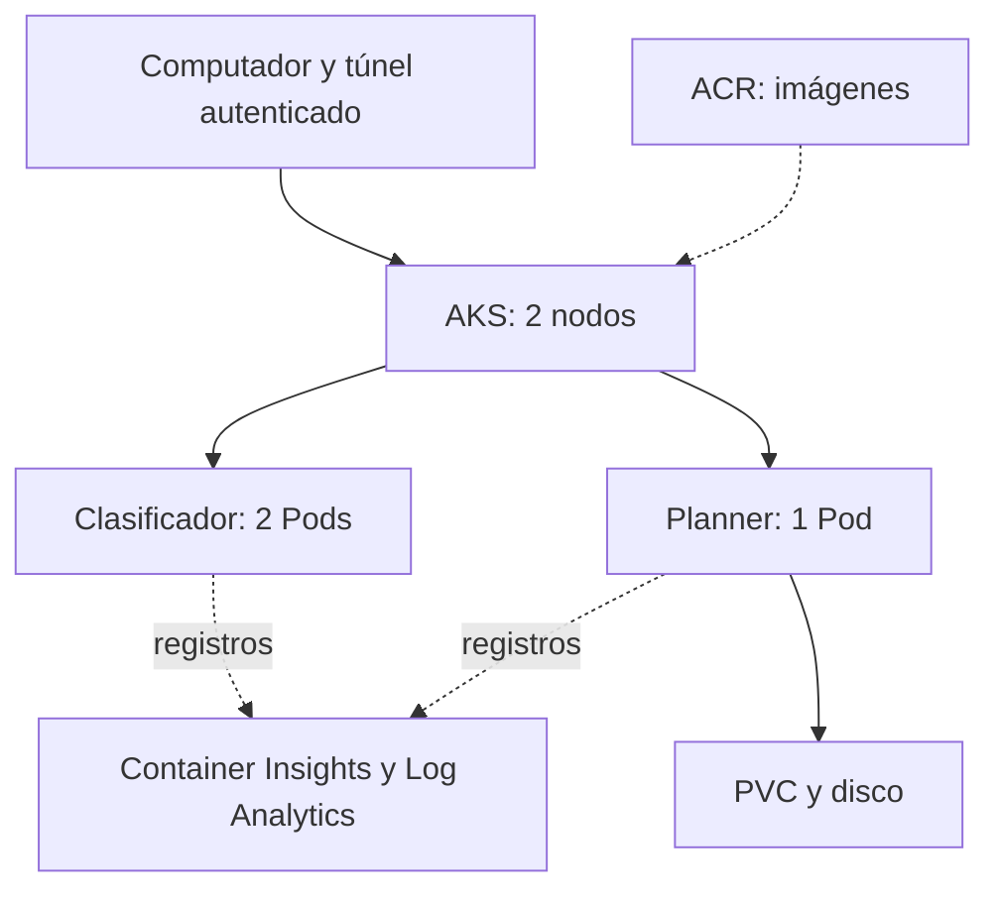

# Guía de ejecución del microproyecto 2

Kubernetes en Azure con clasificación de imágenes, persistencia y monitoreo.

**Integrantes incluidos:** JUAN OSPINA TENORIO, MIGUEL ANGEL DIUZA, NATALIA HERNANDEZ PIEDRAHITA.

**Edición:** 14 de septiembre de 2026.

## 01. Guía de ejecución del microproyecto 2

Kubernetes en Azure con clasificación de imágenes, persistencia y monitoreo.

Una guía para **entender, ejecutar y justificar** el proyecto. Explica la función de cada componente, las decisiones de diseño, las pruebas que debes realizar y las respuestas que debes poder construir con tus propias palabras.

> **Estado de esta edición · 14 de septiembre de 2026**
> **AKS comprobado:** dos nodos, 12 pruebas HTTP, persistencia y monitoreo reales. HPA local repitió el ciclo 1 a 4 a 1. Tras el ensayo del 14 de septiembre se detuvo AKS conservando el disco; Minikube y Docker también quedaron detenidos.

**Equipo:** los tres integrantes de esta portada fueron confirmados para la entrega. La sustentación es individual; cada persona debe comprender el proyecto completo y verificar su horario en la plataforma del curso.

Universidad Autónoma de Occidente · Computación en la Nube · Material de preparación y documentación técnica.

## 02. Cómo usar esta guía

Primero comprende la idea; después ejecuta y reúne evidencia.

Cada sección combina **qué se hace, por qué se hace y cómo comprobarlo**. Los comandos son instrucciones para ejecutar desde la carpeta del proyecto. Un comando escrito en este documento no demuestra que ya se haya ejecutado.

| Ruta de lectura | Páginas | Qué podrás explicar |
| --- | --- | --- |
| Comprender el proyecto | 3 a 6 | Problema, objetivos, rúbrica, arquitectura y conceptos. |
| Justificar las aplicaciones | 7 a 12 | Modelo, API, base de datos, contenedores y Kubernetes. |
| Ejecutar de forma ordenada | 13 a 17 | Pruebas locales, Azure, conexión y despliegue. |
| Observar y comprobar | 18 a 21 | Monitoreo, consultas, HPA y resultados reales. |
| Operar y sustentar | 22 a 27 | Costos, errores, guion, preguntas y cambios en vivo. |
| Entregar y cerrar | 28 a 30 | Evidencias, conclusiones, límites y fuentes. |

### Tres estados que debes distinguir

**Implementado:** existe código o configuración. **Comprobado:** una prueba real produjo el resultado registrado. **Pendiente:** falta ejecutar o verificar en el entorno requerido. Por ejemplo, una aplicación implementada y probada en Docker todavía puede estar pendiente de demostración en AKS.

### Dónde está el material

```
apps/          Aplicaciones y contenedores
k8s/           Manifiestos, ajuste AKS y laboratorio HPA
scripts/       Pasos de ejecución y recolección de evidencia
monitoring/    Configuración de registros y consultas KQL
tests/         Pruebas HTTP e imagen de demostración
docs/          Guías y decisiones
evidencias/    Resultados locales y pruebas reales de Azure
```

> **Regla práctica**
> No avances porque una pantalla se vea bien. Avanza cuando puedas explicar el resultado y repetir la comprobación. Conserva el entorno, el momento, la acción y el resultado de cada evidencia.

## 03. Problema, propósito y objetivos

El proyecto estudia cómo operar aplicaciones, además de hacerlas funcionar.

### El problema que se aborda

Una aplicación puede funcionar en un computador y fallar al trasladarse a otro por diferencias de dependencias, configuración o almacenamiento. Además, al reiniciar un contenedor pueden perderse datos si se guardan únicamente dentro de él. Cuando surge un error, hace falta saber qué ocurrió y en qué componente.

El microproyecto usa dos aplicaciones complementarias para estudiar estos problemas: una procesa imágenes sin conservar archivos; la otra guarda tareas académicas. Ambas se empaquetan en contenedores y se preparan para ejecutarse en Kubernetes administrado por Azure.

### Objetivo general

**Implementar y demostrar un entorno de laboratorio en AKS** con al menos dos nodos, un clasificador de imágenes, una aplicación con persistencia y monitoreo, justificando sus decisiones de despliegue y operación.

| Objetivo específico | Cómo se verifica |
| --- | --- |
| Reproducir la ejecución | Construir las imágenes y ejecutar las mismas pruebas HTTP. |
| Administrar las cargas con Kubernetes | Mostrar Deployments, Pods, Services y nodos Ready. |
| Conservar los datos del tablero | Reemplazar el Pod y recuperar la misma tarea desde el PVC. |
| Relacionar uso y comportamiento | Encontrar peticiones y consumo en Azure Monitor. |
| Entender el escalado automático | Observar HPA local aumentar y reducir réplicas. |

### Por qué estas dos aplicaciones

Visión AI representa una carga de cálculo: recibe una imagen y devuelve predicciones. Campus Planner representa una carga con estado: crea, consulta, actualiza y elimina información. La diferencia permite justificar por qué el clasificador se replica y el tablero conserva una sola réplica.

> **Explicación sencilla para sustentar**
> “Elegimos dos aplicaciones con necesidades distintas para demostrar que Kubernetes no se configura igual para una tarea de cálculo que para una aplicación que debe conservar datos”.

## 04. Qué exige y cómo se cumple

La evidencia debe responder directamente a cada punto del enunciado.

| Criterio | Valor | Implementación y prueba necesaria |
| --- | --- | --- |
| Clúster AKS | 1,0 | Creación por Azure Portal, mínimo dos nodos y verificación desde Cloud Shell y CLI local. |
| Clasificador | 1,0 | Visión AI debe procesar una fotografía dentro de un Pod de AKS. |
| Aplicación de interés | 1,0 | Campus Planner debe funcionar en AKS; la persistencia añade una demostración técnica verificable. |
| Monitoreo | 1,0 | Usar servicios de Azure para mostrar consumo y registros de las aplicaciones. |
| Pregunta individual | 1,0 | Cada persona explica conceptos, decisiones y cambios solicitados. |
| Extra elegido: HPA | +0,5 | Aumento y reducción automáticos de Pods. El enunciado permite hacerlo localmente. |

Los valores se transcriben del documento de la asignatura. El profesor define la calificación y cómo aplica el extra. Se eligió **HPA**; no se presenta Kubeflow como una funcionalidad implementada.

### Qué procede del enunciado

AKS por portal, dos nodos, clasificador, segunda aplicación, monitoreo, verificación desde dos entornos y sustentación individual. El ejemplo de clasificación con MXNet se presenta como una sugerencia, no como una biblioteca obligatoria.

### Qué se añadió al diseño

Pruebas automatizadas, validación de entradas, registros estructurados, sondas de salud, límites de recursos, un volumen persistente y guías de diagnóstico. Estas mejoras permiten explicar el comportamiento con evidencia; no reemplazan ninguno de los puntos de Azure.

> **No confundir**
> Dos réplicas del clasificador son dos Pods, no dos nodos. Dos terminales locales tampoco equivalen a verificar desde Cloud Shell y desde el computador.

Fuente del alcance: documento adjunto “2025-03 Microproyecto2.doc” y anuncio del curso compartido por la usuaria.

## 05. Arquitectura del proyecto

Una vista lógica del entorno desplegado y comprobado en Azure.



**Recorrido de una solicitud:** el navegador accede a un puerto local; kubectl abre un túnel autenticado hacia un Pod seleccionado a partir de su Service. La aplicación procesa la petición y devuelve una respuesta. El tablero consulta su base de datos en el volumen persistente.

**Recorrido de una imagen de contenedor:** el código se construye y se publica en Azure Container Registry. Los nodos descargan esa imagen para iniciar los contenedores. ACR almacena las imágenes; no ejecuta las aplicaciones.

**Recorrido de la observación:** las aplicaciones escriben eventos JSON en stdout. El agente de monitoreo los recopila; Log Analytics permite buscarlos con KQL. Las vistas de Azure complementan esos eventos con información del clúster.

> **Alcance del dibujo**
> Los dos nodos son la capacidad del clúster. La ubicación de cada Pod debe comprobarse con get pods -o wide. La distribución del clasificador es preferente, no una garantía. El túnel port-forward selecciona un Pod y no demuestra balanceo entre las dos réplicas.

Diseño propio basado en k8s/base, scripts/02 a 05 y monitoring/. Despliegue real comprobado el 9 de septiembre de 2026.

## 06. Kubernetes explicado sin enredos

Relaciona cada concepto con un objeto concreto de este proyecto.

| Concepto | Qué significa aquí |
| --- | --- |
| Imagen y contenedor | La imagen es el paquete de aplicación y dependencias. El contenedor es una ejecución de ese paquete. |
| Nodo | Máquina que aporta CPU y memoria y ejecuta Pods. El proyecto requiere al menos dos en AKS. |
| Pod | Unidad de ejecución programada sobre un nodo. Aquí contiene un contenedor de una aplicación. |
| Deployment | Declara qué imagen usar y cuántas réplicas mantener. Su controlador crea o reemplaza Pods. |
| Service | Nombre y acceso interno estable que selecciona Pods por etiquetas, como app=classifier. |
| Namespace | Agrupación lógica. Las aplicaciones usan microproyecto2; el laboratorio HPA usa mp2-hpa. |
| PVC y volumen | El PVC solicita almacenamiento. El volumen asociado conserva el archivo de tareas fuera del Pod. |
| Control plane | Coordina el estado deseado. En AKS lo administra Azure; el equipo configura sus cargas. |

### Ejemplo: se elimina un Pod del clasificador

El Deployment sigue declarando dos réplicas. Su controlador detecta que falta una y crea un reemplazo. El nuevo Pod tendrá otro nombre o identificador. La imagen y el Deployment no desaparecen porque se elimine una ejecución.

### Responsabilidad compartida

Azure administra el servicio de Kubernetes, pero eso no escribe la aplicación, valida las fotografías ni diseña la persistencia. El equipo sigue siendo responsable de sus imágenes, permisos, configuración, pruebas y consumo de recursos.

> **Frase que ayuda**
> “Kubernetes compara lo que declaramos con lo que está ejecutándose e intenta corregir la diferencia. Declarar el estado deseado no elimina la necesidad de observar si pudo cumplirlo”.

Base conceptual: [S1] Deployments; aplicación concreta: k8s/base/classifier.yaml y planner.yaml.

## 07. Visión AI: qué hace y por qué

Clasificación real de imágenes con un modelo preentrenado.

### La necesidad y la elección

Visión AI recibe una fotografía y muestra cinco etiquetas ordenadas por puntuación. Se eligió MobileNetV3 Small para una demostración de inferencia en CPU, sin añadir una GPU al laboratorio. Esta es una decisión de alcance; no se ha medido una comparación de rendimiento entre varios modelos.

La implementación fija PyTorch 2.8.0 y TorchVision 0.23.0 y carga los pesos IMAGENET1K_V1. Trabaja con **1.000 categorías ImageNet, en inglés**. El ejemplo sugerido en el enunciado usa MXNet y diez categorías CIFAR-10: sus etiquetas y resultados no son equivalentes. [S3]

| Paso | Qué ocurre en el código |
| --- | --- |
| 1. Recibir y validar | El campo multipart debe llamarse img. Se comprueba el archivo decodificado, formato, tamaño de petición y píxeles. |
| 2. Preparar | Se corrige orientación EXIF, se convierte a RGB y se aplican las transformaciones asociadas a los pesos. |
| 3. Inferir | El tensor entra al modelo en modo de evaluación y sin cálculo de gradientes. No se modifica el modelo. |
| 4. Ordenar | Softmax produce puntuaciones relativas; topk selecciona las cinco mayores. |
| 5. Responder | La API devuelve etiquetas, puntuaciones, tiempo medido, dimensiones y nombre del Pod. |

### Por qué el modelo se incluye al construir la imagen

Los pesos se descargan durante el build de Docker. El contenedor usa la copia incluida, por lo que cada inicio no depende de volver a descargar el modelo. Un bloqueo protege la inferencia y Torch usa un hilo de CPU para hacer más predecible el consumo del laboratorio.

> **Cómo justificarlo**
> “Nuestro trabajo integra y despliega un modelo preentrenado. Demostramos el servicio HTTP, el contenedor y su operación en Kubernetes; no afirmamos haber entrenado la red desde cero”.

Archivos: apps/classifier/app.py, download_model.py y Dockerfile. Fuente del modelo: [S3].

## 08. Cómo comprobar el clasificador

Una predicción visible debe poder relacionarse con su API y su Pod.

Abre http://localhost:8081 con el entorno correspondiente en ejecución. Usa primero tests/fixtures/dog.jpg y después imágenes adicionales. Para evitar el límite de petición, prepara archivos JPEG, PNG o WebP de menos de 4 MB; el límite total configurado es 5 MB, incluido el contenido multipart.

```
curl --fail -F img=@tests/fixtures/dog.jpg \
  http://localhost:8081/predict
```

| Dato | Resultado local guardado | Qué significa |
| --- | --- | --- |
| Primera etiqueta | Samoyed | Predicción para esta imagen de prueba. |
| Puntuación | 0,757887 ≈ 75,79 % | Puntuación softmax, no certeza universal. |
| Medida de tiempo | 13,15 ms | Una observación local; no es rendimiento de AKS. |
| Dimensiones | 1546 × 1213 | Tamaño de la imagen después de corregir orientación. |

La lista completa local fue Samoyed, Arctic fox, Pomeranian, wallaby y Great Pyrenees. El archivo evidencias/local/08-prediccion-real.json conserva la respuesta. No copies su nombre de contenedor como si fuera un Pod de Azure.

### Prueba de error controlado

```
curl -i -X POST http://localhost:8081/predict
curl --fail http://localhost:8081/readyz
```

La primera petición debe responder 400 por falta de imagen; la segunda debe seguir respondiendo 200. Así demuestras que una entrada incorrecta se rechaza sin hacer caer el servicio. Un archivo de un formato no admitido puede producir 415; una petición demasiado grande, 413.

### Interpretación honesta del resultado

Una sola foto acertada demuestra funcionamiento, no precisión global. El modelo puede equivocarse, especialmente con dibujos, documentos o categorías fuera de su dominio. El valor inference_ms incluye transformaciones y espera del bloqueo; no incluye toda la comunicación del navegador.

> **Evidencia de AKS obtenida**
> La respuesta 04-inferencia.json registra Samoyed con puntuación 0,757887 y 19,52 ms de inferencia en classifier-74999b7f6-whkqc. Los recursos y las capturas se conservan en evidencias/azure/. Es una observación, no una medición de precisión global.

## 09. Campus Planner: aplicación con datos

Un tablero académico permite demostrar operaciones y persistencia.

### Qué resuelve

El tablero organiza actividades por título, asignatura y estado. Se puede crear una tarea, verla en la lista, pasarla a en curso o completada y eliminarla. Los contadores de la interfaz se calculan con las tareas obtenidas de la API.

| Acción | Ruta HTTP | Respuesta esperada |
| --- | --- | --- |
| Consultar | GET /api/tasks | 200 con lista tasks. |
| Crear | POST /api/tasks | 201 con la tarea y su id. |
| Cambiar estado | PATCH /api/tasks/{id} | 200 con el nuevo estado. |
| Eliminar | DELETE /api/tasks/{id} | 204 sin cuerpo. |
| Comprobar disponibilidad | GET /readyz | 200 si una consulta a SQLite funciona. |

### Cómo se guarda la información

La tabla tasks tiene id, title, course, status y created_at. El archivo se almacena en /data/planner.db; /data se monta desde un volumen. SQLite simplifica el laboratorio porque no exige administrar un servidor de base de datos separado.

Las consultas usan parámetros para tratar las entradas como datos. El código valida títulos de 1 a 120 caracteres y asignaturas de 1 a 60. Los estados admitidos son pendiente, en-curso y completada. Un id inexistente produce 404; una entrada inválida, 400.

### Por qué una réplica y estrategia Recreate

La aplicación no se diseñó para múltiples escritores distribuidos. Recreate termina la ejecución anterior antes de iniciar la nueva; una réplica reduce problemas de concurrencia con el archivo SQLite. A cambio, puede haber una interrupción breve al actualizar o reemplazar el Pod.

> **Límite del alcance**
> Es un tablero compartido de laboratorio, sin cuentas ni autorización individual. Usa datos de ejemplo. Para múltiples usuarios reales harían falta autenticación, autorización, respaldos y un diseño de base de datos adecuado.

La justificación describe la implementación existente de apps/planner/app.py y k8s/base/planner.yaml.

## 10. Persistencia: demostrar, no asumir

La prueba consiste en cambiar el Pod y conservar la misma información.

En AKS, el PVC planner-data solicita 1 GiB mediante la StorageClass managed-csi. El disco es independiente de la ejecución del Pod. ReadWriteOnce permite escritura desde un nodo; no significa por sí solo que únicamente un Pod pueda acceder. Aquí se complementa con una réplica y Recreate. [S2]

| Momento | Acción | Qué guardar |
| --- | --- | --- |
| Antes | Crear una tarea y consultar /api/tasks. | Identificador, título y estado. |
| Antes | Consultar Pod y PVC. | UID del Pod y nombre del volumen. |
| Cambio | Reiniciar el Deployment de planner. | Esperar a que la nueva ejecución esté lista. |
| Después | Abrir de nuevo el túnel si se cerró y consultar tareas. | Misma tarea, nuevo UID y mismo PVC. |

```
export KUBECONFIG="$PWD/.kube/aks.config"
kubectl -n microproyecto2 get pods -l app=planner -o wide
kubectl -n microproyecto2 get pvc planner-data
curl --fail http://localhost:8082/api/tasks

kubectl -n microproyecto2 rollout restart deployment/planner
kubectl -n microproyecto2 rollout status deployment/planner \
  --timeout=300s
kubectl -n microproyecto2 get pods -l app=planner -o wide
```

Para comparar el UID puedes usar la vista detallada del Pod con kubectl describe pod. Reabre el acceso con scripts/04-open-apps.sh si el túnel quedó asociado al Pod anterior. Después consulta /api/tasks y comprueba el mismo id.

### Qué prueba y qué no prueba

El resultado demuestra persistencia frente al reemplazo del Pod en ese entorno. No demuestra respaldo, recuperación ante pérdida del disco ni alta disponibilidad. Borrar el PVC o el grupo de recursos puede eliminar los datos según la política de recuperación.

> **Frase para sustentar**
> “La información sobrevive porque el archivo vive en un volumen independiente del Pod. Si borramos el volumen, esa protección deja de existir; por eso persistencia y respaldo son necesidades diferentes”.

## 11. Contenedores y seguridad del laboratorio

Cada medida responde a una necesidad concreta del proyecto.

Las aplicaciones usan Flask para las rutas HTTP y Gunicorn como servidor de ejecución del contenedor. El Dockerfile describe la imagen; Docker Compose permite probarla localmente. Kubernetes usará imágenes publicadas con la arquitectura de CPU de sus nodos.

| Decisión implementada | Razón y límite |
| --- | --- |
| Usuario UID 10001 | La aplicación no necesita ejecutarse como root. Reduce privilegios dentro del contenedor. |
| Archivos de solo lectura | La aplicación escribe únicamente donde lo necesita: /tmp y /data en el tablero. |
| Sin elevación y sin capabilities | Se evita dar capacidades del sistema que las rutas HTTP no requieren. |
| Sin token de ServiceAccount | Las aplicaciones no llaman a la API de Kubernetes; no necesitan ese token montado. |
| Entradas validadas | Se rechazan imágenes o tareas inválidas antes de continuar el procesamiento. |
| Services ClusterIP y túnel local | La demostración no publica directamente las aplicaciones en Internet. |
| Registros con identificadores | Permiten investigar peticiones sin guardar fotografías ni títulos de tareas en los logs de aplicación. |

### Reproducción y versiones

Las versiones principales de la aplicación están fijadas. Algunas dependencias transitivas y la imagen base pueden cambiar: eso limita una reproducción idéntica en el futuro. Guardar digests, hashes y el inventario de versiones daría mayor precisión a una entrega posterior.

### Qué queda fuera

No se configuraron un dominio público, TLS externo, inicio de sesión para usuarios ni límites de peticiones por persona. Los controles del contenedor mejoran el laboratorio, pero no convierten el tablero en un producto listo para publicación pública.

> **Arquitecturas diferentes**
> Las pruebas locales se hicieron en Apple Silicon con imágenes ARM64. Los nodos DS2 v2 requieren linux/amd64. El flujo de publicación prepara esa arquitectura; su ejecución en AKS se comprobó y se repitió el 14 de septiembre.

## 12. Manifiestos: recursos, salud y réplicas

Estos valores explican cómo Kubernetes debe ejecutar las aplicaciones.

| Aplicación | Réplicas | Requests por Pod | Limits por Pod |
| --- | --- | --- | --- |
| Clasificador | 2 | 250m CPU / 384Mi | 1 CPU / 1Gi |
| Planner | 1 | 100m CPU / 64Mi | 500m CPU / 256Mi |
| CPU demo local | 1 a 4 | 100m CPU / 64Mi | 500m CPU / 128Mi |

1000m equivalen a un núcleo. Los requests de las aplicaciones suman **600m y 832Mi** con la configuración base: 2 × 250m + 100m y 2 × 384Mi + 64Mi. A eso se añaden Kubernetes, monitoreo y otros procesos. El total de recursos de las máquinas no queda íntegramente disponible para las aplicaciones.

Los requests ayudan al planificador a ubicar los Pods. Los limits acotan consumo; alcanzar el límite de CPU puede producir throttling y superar el de memoria puede terminar el contenedor. Los valores elegidos son iniciales y deben contrastarse con observaciones en AKS.

| Sonda | Pregunta que responde | Uso en el proyecto |
| --- | --- | --- |
| startup | ¿Terminó de iniciar? | Da tiempo al modelo y a la base antes de las demás comprobaciones. |
| readiness | ¿Puede recibir tráfico? | /readyz comprueba disponibilidad; en Planner consulta SQLite. |
| liveness | ¿Sigue respondiendo? | /healthz permite detectar falta de respuesta y reiniciar si corresponde. |

### Leer un fragmento de YAML

```
spec:
  replicas: 2
  selector:
    matchLabels: {app: classifier}
  template:
    metadata:
      labels: {app: classifier}
```

replicas declara cuántas ejecuciones mantener. Las etiquetas relacionan el Deployment con sus Pods y el Service con sus destinos. Cambiar una etiqueta sin adaptar el selector puede dejar un Service sin destinos.

Sondas: [S4]. Valores exactos: k8s/base/classifier.yaml, planner.yaml y k8s/hpa/demo.yaml.

## 13. Ejecutar primero en el computador

Esta etapa detecta errores de aplicación antes de consumir crédito de Azure.

### 1. Preparar la terminal

Abre Docker Desktop y una terminal dentro de microproyecto2-aks. Debes ver compose.yaml al listar la carpeta. Las pruebas HTTP usan Python 3 y no requieren instalar PyTorch en el computador: el modelo vive dentro del contenedor.

```
docker compose up -d --build --wait
docker compose ps
python3 -m unittest discover -s tests -v
```

**Qué hace:** construye las imágenes, inicia ambos servicios y espera sus comprobaciones de salud. **Qué esperar:** dos servicios saludables y las 12 pruebas aprobadas. La primera construcción descarga dependencias y pesos; puede tardar más que los siguientes inicios.

### 2. Recorrer las interfaces

Abre **http://localhost:8081** para Visión AI y **http://localhost:8082** para Campus Planner. Procesa la imagen de prueba; crea una actividad, cambia su estado y recarga el tablero. Explica qué llamada a la API respalda cada acción.

### 3. Probar persistencia local

```
curl --fail http://localhost:8082/api/tasks
docker compose up -d --force-recreate planner
curl --fail http://localhost:8082/api/tasks
```

Espera a que Planner vuelva a estar saludable antes de la segunda consulta. La misma tarea debe permanecer en el volumen de Docker. Esta prueba es local; debe repetirse posteriormente con el PVC de AKS.

### 4. Cerrar o reabrir sin borrar tareas

```
docker compose stop
# Para continuar otra sesión:
docker compose up -d --wait
```

> **Cuidado con los puertos y los datos**
> Antes de abrir túneles a AKS, detén Compose para liberar 8081 y 8082. docker compose down conserva el volumen; añadir -v lo elimina. No uses esa opción para una simple pausa.

Opcional: scripts/10-test-kubernetes-local.sh ensaya los manifiestos en Minikube; tampoco sustituye la evidencia de AKS.

## 14. Azure: estado de la cuenta y cuotas

Lo observado en esta suscripción determina la configuración viable.

| Comprobación del 9 de septiembre de 2026 | Resultado registrado |
| --- | --- |
| Suscripción | Azure for Students activa. |
| Crédito mostrado | USD 100 antes de crear recursos; vence el 9 de septiembre de 2027. El saldo posterior debe consultarse. |
| Acceso desde el computador | Azure CLI 2.90.0 instalada e inicio de sesión completado. |
| Proveedores | Compute, ContainerService, Network, ContainerRegistry, OperationalInsights e Insights registrados. |
| Regiones permitidas por política | Chile Central, Brazil South, North Central US, Canada Central y West US. |
| Opción encontrada | Chile Central, Standard_DS2_v2, cuota de familia 4 vCPU y regional 6 vCPU. |

### Por qué no basta escoger una región conocida

Son comprobaciones distintas: la política permite una región; la cuota limita cuántos recursos admite la suscripción; la disponibilidad indica si un tamaño se ofrece para esa cuenta. Aun con esas condiciones, el aprovisionamiento real puede fallar por capacidad del momento.

En North Central US aparecían tamaños modernos disponibles, pero su familia tenía cuota cero. La solicitud automática de ampliar DASv5 a 6 vCPU fue rechazada. La revisión de las cinco regiones encontró DS2 v2 con cuota en Chile Central. Esta búsqueda justifica la región elegida.

### Configuración local del proyecto

El archivo .env ya fue preparado en este computador; consérvalo. Contiene los nombres y la suscripción, no contraseñas. En una copia nueva, crea .env a partir de .env.example y completa tus valores. Las sesiones de Azure están aisladas en .azure/ y quedan fuera del paquete para compartir.

```
bash scripts/00-check-azure.sh
```

> **Estado exacto**
> AKS fue creado por Azure Portal. Se comprobaron dos nodos Ready, Kubernetes 1.35.7 y ambas aplicaciones en Chile Central. La conexión local y la sesión real de Cloud Shell están documentadas en evidencias/azure/.

Evidencia de preparación: evidencias/azure/00-preparacion-portal.md. El PDF de activación adjunto es histórico; la cuenta ya está activa.

## 15. Crear AKS desde Azure Portal

El portal es parte del requisito del curso y debe quedar evidenciado.

En Azure Portal busca Kubernetes services, inicia la creación de un clúster y configura el laboratorio. Si retomas el formulario preparado, verifica sus valores antes de continuar. Si lo reconstruyes, usa esta ficha; los nombres de las opciones pueden cambiar. [S5]

| Campo | Configuración preparada | Justificación |
| --- | --- | --- |
| Nombre y grupo | aks-microproyecto2 / rg-microproyecto2 | Identificación y limpieza de recursos exclusivos. |
| Región | Chile Central | Disponibilidad y cuota observadas para esta cuenta. |
| Preset y plan | Dev/Test / Free | Laboratorio; Free no elimina el costo de las máquinas. |
| Versión | 1.35.7 ofrecida por el portal | Volver a comprobar compatibilidad al recrear. |
| Grupo de nodos | System, Ubuntu, DS2 v2 | Opción que pasó la validación del formulario. |
| Cantidad y zonas | 2, manual, sin zonas | Cumple el mínimo y mantiene fijo el número de nodos. |
| Red | Azure CNI Overlay y LB Standard | Configuración preparada para conectividad del laboratorio. |
| Acceso e identidad | Identidad administrada y RBAC de Kubernetes | Permisos para administrar y consumir las imágenes. |
| Registros | Activar después con script 05 | Usar un workspace dentro del grupo exclusivo. |

El grupo de infraestructura preparado es MC_rg-microproyecto2_aks-microproyecto2_chilecentral. Evita agregar grupos de nodos o servicios opcionales por accidente. Al editar, vuelve a verificar que el resumen conserve **dos nodos** y el tamaño esperado.

### Validación no es creación

Guarda la configuración en Revisar y crear. Solo después de aceptar el consumo previsto, crea el recurso, espera Provisioning state: Succeeded y verifica los nodos. Una validación favorable no prueba que las máquinas ya existan.

> **Cuota y actualizaciones**
> La documentación general y el preset muestran requisitos diferentes; se conserva la validación observada sin afirmar equivalencia universal. Dos DS2 v2 consumen la cuota de familia. El grupo System exige maxUnavailable=0; un nodo temporal de actualización requeriría más cuota. [S6]

## 16. Conectar desde dos entornos

Cloud Shell y la terminal local deben mostrar el mismo clúster real.

### En el computador

Después de que AKS termine de crearse, ejecuta el script de conexión desde la carpeta del proyecto. Reutiliza la sesión local de Azure y descarga la configuración en .kube/aks.config para no mezclarla con otros contextos.

```
bash scripts/01-connect.sh cli-local
export KUBECONFIG="$PWD/.kube/aks.config"
kubectl config current-context
kubectl get nodes -o wide
```

El script guarda evidencias/azure/01-nodos-cli-local.txt y comprueba que existan al menos dos nodos con condición Ready=True. Si solo hay uno o alguno no está listo, no da el requisito por cumplido.

### En Cloud Shell Bash

Abre Cloud Shell desde Azure Portal. Utiliza una copia del proyecto obtenida del repositorio publicado o cargando el paquete. Completa allí su .env con la misma suscripción y nombres. No copies las carpetas de credenciales del computador; Cloud Shell usa su propio acceso.

```
cd microproyecto2-aks
bash scripts/01-connect.sh cloud-shell
export KUBECONFIG="$PWD/.kube/aks.config"
kubectl get nodes -o wide
```

Guarda 01-nodos-cloud-shell.txt y una captura donde sea visible que la terminal pertenece al portal. Compara el nombre del clúster y los nodos con la salida local. El argumento cloud-shell solo etiqueta el archivo: debes ejecutarlo realmente desde ese entorno.

| Observación | Interpretación |
| --- | --- |
| Ready en dos nodos | El plano de control reconoce dos nodos listos. |
| Mismos nodos desde ambos lugares | Se administró el mismo clúster por dos entornos de acceso. |
| kubectl responde | El contexto, la autenticación y la conectividad permiten la consulta. |

> **Contextos separados**
> AKS usa .kube/aks.config. El extra local usa .kube/minikube.config. Antes de un cambio, confirma el contexto. Cambiar una variable en una terminal no la cambia automáticamente en las demás.

Conexión documentada por Microsoft: [S5]. Comportamiento exacto de la comprobación: scripts/01-connect.sh.

## 17. Publicar imágenes y desplegar

Construir, almacenar y ejecutar son pasos diferentes.

### 1. Publicar en Azure Container Registry

```
bash scripts/02-publish-images.sh
```

El script crea ACR Basic en el grupo exclusivo si no existe, con usuario administrador desactivado y permisos RBAC. Asocia el registro a AKS y construye mp2-classifier:v1 y mp2-planner:v1 para linux/amd64. El registro preparado tiene un nombre único guardado en .env.

La identidad de kubelet debe poder descargar las imágenes mediante AcrPull en este modo. Si el registro utiliza ABAC, el flujo y el rol cambian; el script se detiene para evitar aplicar la configuración equivocada. [S7]

### 2. Preparar y aplicar los manifiestos

```
bash scripts/03-deploy.sh
```

El ajuste de AKS selecciona managed-csi para el PVC. El script reemplaza los nombres de imagen por las rutas del registro, crea el namespace, solicita una validación al servidor, aplica los recursos y espera los Deployments. Consulta después Pods, Services y PVC.

### 3. Abrir el acceso y comprobar

```
docker compose stop
bash scripts/04-open-apps.sh
# Deja esa terminal abierta; en otra terminal:
python3 -m unittest discover -s tests -v
```

El script abre 8081 para el clasificador y 8082 para el tablero, vinculados a 127.0.0.1. Aunque el navegador muestre localhost, las respuestas proceden de AKS si los túneles apuntan a su contexto. Corrobóralo con el Pod devuelto y los logs; la URL sola no identifica el entorno.

### Si ACR Tasks está restringido

ACR Tasks rechazó la construcción en Chile Central. Se construyeron y publicaron ambas imágenes con buildx local para linux/amd64. El script 02 selecciona ahora esa ruta automáticamente en Chile. ACR almacena las imágenes y los nodos AKS las ejecutan.

> **Cambios posteriores**
> Usa una nueva etiqueta, por ejemplo v2, al publicar una revisión. Con IfNotPresent, reutilizar v1 puede conservar una imagen anterior en los nodos. Guarda qué versión produjo cada evidencia.

Scripts 02, 03 y 04; k8s/overlays/aks; integración oficial ACR-AKS: [S7].

## 18. Monitoreo: qué observar y por qué

Una aplicación que responde también debe poder investigarse.

### Tres fuentes complementarias

| Fuente | Qué responde | Uso en la demostración |
| --- | --- | --- |
| Estado de Kubernetes | ¿Está ejecutándose y disponible? | Pods, Deployments, eventos y reinicios. |
| Métricas | ¿Cuánto consume o tarda? | CPU, memoria, número de peticiones y duración. |
| Registros | ¿Qué petición o evento ocurrió? | Ruta, código HTTP, duración, request_id y Pod. |

### Activar el servicio de Azure

```
bash scripts/05-monitoring.sh
```

Log Analytics y Container Insights están habilitados con intervalo de un minuto, filtro microproyecto2 y retención de 30 días. Se añadió streams al archivo para Azure CLI 2.90. La consulta devolvió 11 solicitudes reales en la primera verificación con datos. [S8]

### Demostración ordenada

**1.** Abre AKS → Monitoring → Insights y elige el intervalo de la prueba. **2.** Procesa varias imágenes y crea una tarea. **3.** Envía una petición sin imagen para obtener un 400. **4.** Consulta Logs en el workspace correcto y relaciona una petición con su Pod. **5.** Explica el comportamiento observado, incluso si un pico breve no es visible por la agregación.

```
curl -i -X POST http://localhost:8081/predict
export KUBECONFIG="$PWD/.kube/aks.config"
kubectl top nodes
kubectl -n microproyecto2 top pods
```

### Lo que no se recopila automáticamente

Las aplicaciones exponen /metrics en formato Prometheus, pero la configuración actual no despliega Prometheus administrado ni un recolector para ese endpoint. No afirmes que sus contadores ya están en Azure. Las evidencias principales usan Container Insights y ContainerLogV2.

> **Cómo interpretar un error**
> Un 400 por imagen ausente indica validación de una petición incorrecta, no caída del clúster. Un 5xx requiere investigar la aplicación. Un Pod reiniciado necesita correlacionar eventos y registros, no solo mirar el código HTTP.

## 19. KQL: convertir logs en explicación

Ejecuta cada consulta por separado dentro del workspace de Log Analytics.

### Encontrar solicitudes de las aplicaciones

```
ContainerLogV2
| where TimeGenerated > ago(1h)
| where PodNamespace == "microproyecto2"
| extend e = parse_json(tostring(LogMessage))
| where tostring(e.event) == "http_request"
| project TimeGenerated, PodName, path=tostring(e.path),
          status=toint(e.status),
          duration_ms=todouble(e.duration_ms),
          request_id=tostring(e.request_id)
| order by TimeGenerated desc
```

**where** filtra por tiempo, namespace y tipo de evento. **extend** interpreta el texto JSON. **project** elige las columnas de interés. **order by** muestra primero los registros recientes. Los nombres de campos corresponden a apps/common/observability.py.

### Qué debes explicar de una fila

Identifica la ruta /predict, el código de respuesta, el Pod que atendió la solicitud y su duración. La cabecera X-Request-ID permite relacionar una respuesta HTTP con un evento de aplicación. Los logs omiten las comprobaciones de salud para reducir ruido.

| Medida o situación | Lectura correcta |
| --- | --- |
| duration_ms | Duración medida en el servidor; no equivale a todo el tiempo del navegador. |
| p95_ms | Percentil calculado sobre la muestra consultada. Con pocas peticiones es poco representativo. |
| Consulta vacía | Puede deberse a filtros, rango temporal, falta de ingesta o ausencia real del evento. |
| Reinicios | Compara el inventario y el periodo. Un Pod nuevo es otro objeto. |

### Si no aparecen datos

Comprueba workspace, clúster, namespace e intervalo; revisa que el add-on y los agentes estén activos; genera nuevas peticiones y espera la ingesta. Una tabla inexistente no significa “cero errores”. monitoring/queries.kql incluye además agrupación por minuto, p95, inventario y eventos Warning.

> **Evidencia real guardada**
> 05-consulta-1.json contiene solicitudes recuperadas desde Log Analytics, con ruta, estado, duración, Pod e identificador. 05-consulta-2.json resume la actividad. Repite python3 scripts/12-query-monitoring.py para exportar la ventana reciente.

## 20. HPA: entender y ejecutar el extra

Se demuestra en Minikube para separar el aprendizaje del gasto de Azure.

Horizontal Pod Autoscaler ajusta el número de réplicas según una métrica. El laboratorio usa una aplicación de carga CPU distinta de Planner: evita escalar horizontalmente una base SQLite que no fue diseñada para ello. No se requiere Kubeflow para la alternativa elegida.

| Parámetro del laboratorio | Valor y razón |
| --- | --- |
| Contexto y namespace | mp2-hpa: separa este ejercicio del clúster de Azure. |
| Réplicas | Mínimo 1, máximo 4: crecimiento visible y acotado. |
| CPU request | 100m por Pod: referencia del porcentaje de utilización. |
| Objetivo | 50 % de CPU sobre el request; aproximadamente 50m. |
| Bajada | Ventana de estabilización configurada de 60 segundos. |
| Generador | Job inicialmente suspendido, límite de ejecución 300 segundos. |

```
bash scripts/08-hpa-local.sh
export KUBECONFIG="$PWD/.kube/minikube.config"
kubectl config current-context
kubectl -n mp2-hpa get hpa,pods
kubectl -n mp2-hpa top pods
bash scripts/14-reset-hpa-load.sh
bash scripts/09-verify-hpa.sh
```

El primer script prepara Minikube, metrics-server y la aplicación. El script 14 renueva solo el Job vencido. El script 09 observa una réplica inicial, inicia carga, espera cuatro réplicas disponibles, suspende la carga y espera el regreso a una. Guarda evidencias/local/03-hpa-ciclo.txt. No modifica réplicas manualmente durante esa comprobación.

### Ejemplo numérico para explicar el mecanismo

Una aproximación de la decisión es redondear hacia arriba: réplicas actuales × utilización actual / objetivo. Si hay 2 réplicas, la utilización media es 100 % y el objetivo 50 %, la propuesta básica es 4. El controlador también considera límites, disponibilidad de métricas, tolerancia y estabilización. [S9]

> **Dos diferencias importantes**
> HPA cambia Pods; el autoscaler del clúster cambia nodos. kubectl scale es escalado manual y no demuestra HPA. El valor <unknown> indica que no hay una medida utilizable; no significa CPU en cero.

## 21. Pruebas y resultados comprobados

Pruebas históricas del 9 y repetición del 14 de septiembre de 2026.

| Comprobación real | Resultado | Evidencia local |
| --- | --- | --- |
| HTTP en Docker | 12 pruebas aprobadas. | 01-pruebas-http.txt |
| Inferencia de la foto de ejemplo | Samoyed como primera etiqueta. | 08-prediccion-real.json |
| Aplicaciones en Kubernetes local | 2 Pods de clasificación y 1 de Planner. | 04-kubernetes-aplicaciones.txt |
| HTTP contra Kubernetes local | Las mismas 12 pruebas aprobadas. | 04-kubernetes-aplicaciones.txt |
| Persistencia al reemplazar Pod | Nuevo UID, mismo PVC y tarea conservada. | 04-kubernetes-aplicaciones.txt |
| Ciclo HPA | 1 réplica → 4 disponibles → 1. | 03-hpa-ciclo.txt |

### Qué cubren las 12 pruebas HTTP

Las seis del clasificador comprueban disponibilidad del modelo, inferencia, imagen ausente, archivo inválido, exceso de tamaño y métricas. Las seis del tablero comprueban CRUD, caracteres especiales tratados como datos, validación, estados o ids inválidos, interfaz y cabeceras, y disponibilidad de SQLite.

### Observación del HPA guardada

En la repetición del 14 de septiembre de 2026 (Colombia), la carga empezó a las 01:45:34 UTC del día 15. Hubo cuatro réplicas disponibles a las 01:46:44 y una a las 01:49:27. El Job vencido se renovó antes del ciclo; no se forzaron réplicas manualmente.

### Demostración en Azure completada

AKS se creó por Portal y Cloud Shell se comprobó el 9 de septiembre. El 14 se repitió la CLI local: dos nodos Ready, imágenes AMD64 y 12 pruebas aprobadas en 19,804 s. Planner conservó la tarea y el PVC al cambiar de Pod. KQL devolvió solicitudes; scripts/11 y 12 repiten estas pruebas.

> **Cómo justificar las pruebas**
> “No probamos solo que abra la página. Comprobamos respuestas correctas, entradas inválidas, persistencia y comportamiento bajo carga. Los resultados locales prepararon la ejecución y las pruebas se repitieron en Azure”.

La relación detallada se conserva en docs/RESULTADOS.md y tests/test_http.py.

## 22. Costos, conservación y destrucción

El crédito se cuida limitando el tiempo de uso y verificando la limpieza.

El portal mostró USD 196,37 al mes por una máquina DS2 v2 en Chile Central. Tomando 730 horas como referencia, dos máquinas equivalen aproximadamente a **USD 0,538 por hora**. Son estimaciones de máquinas observadas el 9 de septiembre de 2026, no una factura ni un total garantizado.

| Tiempo encendido | Solo dos máquinas, estimado |
| --- | --- |
| 1 hora | USD 0,54 |
| 4 horas | USD 2,15 |
| 24 horas | USD 12,91 |
| 7 días continuos | USD 90,38 |

Se añaden discos, red, direcciones o balanceador, ACR y datos de monitoreo, según uso y facturación. Pedir 1 GiB en un PVC no implica que el proveedor facture exactamente 1 GiB. Un presupuesto puede avisar y la información de costos puede tardar; no es un corte inmediato de consumo.

### Antes de eliminar

```
mkdir -p privadas
curl --fail http://localhost:8082/api/tasks \
  > privadas/tareas-respaldo.json
bash scripts/06-evidence.sh
```

Guarda también capturas del portal, salidas de KQL, imágenes de prueba y configuración. tareas-respaldo.json es una exportación de las tareas; esta aplicación no incorpora un comando automático para restaurar todos sus campos. Usa datos de ejemplo y conserva el archivo fuera de publicaciones innecesarias.

### Eliminar únicamente el grupo del microproyecto

```
bash scripts/07-delete-azure.sh
```

El script enumera recursos, pide escribir ELIMINAR seguido del nombre exacto del grupo y elimina sus recursos. Comprueba después que tanto el grupo dedicado como el administrado de nodos ya no existan. Revisa en el portal recursos externos y consumo pendiente.

> **Recreación para la sustentación**
> Guardar código y manifiestos permite recrear; no conserva por sí solo los datos eliminados. Reconstruye por portal aproximadamente un día antes, valida disponibilidad de nuevo y repite las pruebas. Detener AKS puede dejar conceptos facturables: no equivale a destruirlo.

## 23. Diagnóstico: del síntoma a la causa

Antes de cambiar algo, identifica el contexto y observa el estado.

```
export KUBECONFIG="$PWD/.kube/aks.config"
kubectl config current-context
kubectl -n microproyecto2 get pods,pvc
kubectl -n microproyecto2 get events \
  --sort-by=.metadata.creationTimestamp
```

| Síntoma | Qué revisar | Corrección razonable |
| --- | --- | --- |
| QuotaExceeded o tamaño no disponible | Familia, región, política y capacidad. | Elegir opción permitida o resolver cuota; no reducir a un nodo. |
| ImagePullBackOff | Nombre y etiqueta de imagen, ACR, identidad y conectividad. | Corregir referencia o permiso de descarga. |
| exec format error | Arquitectura de la imagen. | Reconstruir para linux/amd64 en los nodos elegidos. |
| Pod Pending | Eventos del Pod, recursos y estado del PVC. | Resolver la condición concreta de planificación o almacenamiento. |
| CrashLoopBackOff | Logs, causa de salida y memoria. | Corregir el fallo; reiniciar sin diagnóstico suele repetirlo. |
| PVC Pending | StorageClass, eventos y disponibilidad de disco. | Verificar managed-csi y el motivo que informa el proveedor. |
| localhost no responde | Compose, puertos, contexto y túnel. | Liberar 8081/8082 o reabrir port-forward. |
| No hay logs en Azure | Workspace, add-on, filtros y tiempo de ingesta. | Generar peticiones y confirmar que el agente las recopila. |
| HPA muestra <unknown> | metrics-server, requests y contexto local. | Esperar métricas válidas y leer las condiciones del HPA. |

Para profundizar usa kubectl describe pod NOMBRE_DEL_POD y kubectl logs NOMBRE_DEL_POD dentro del namespace correcto. Si el contenedor reinició, logs --previous puede ayudar cuando existe un registro de la ejecución anterior.

> **Cómo responder al profesor**
> “Primero observo el estado y los eventos; después formulo una causa posible y hago una corrección pequeña. Vuelvo a ejecutar la misma prueba para comprobar si realmente la resolví”.

## 24. Guion sencillo de sustentación

La secuencia enlaza una necesidad, una decisión y una prueba.

### Apertura para adaptar con tus palabras

“El proyecto prepara dos aplicaciones para AKS. Una clasifica fotografías sin guardar archivos y otra administra tareas que deben persistir. Voy a mostrar el clúster, ejecutar ambas aplicaciones, reemplazar un Pod para comprobar los datos y relacionar las acciones con monitoreo. El extra muestra HPA en un entorno local”.

Cuando el despliegue real esté terminado, puedes sustituir “prepara” por “despliega”. La presentación debe describir el estado que realmente puedas mostrar ese día.

| Ensayo orientativo | Qué mostrar | Idea central |
| --- | --- | --- |
| 0 a 1 minuto | Arquitectura y AKS en el portal. | Qué administra Azure y qué configura el equipo. |
| 1 a 2 | Cloud Shell y CLI local. | Mismo clúster, al menos dos nodos Ready. |
| 2 a 4 | Fotografía y respuesta del clasificador. | Inferencia, predicciones y Pod que responde. |
| 4 a 6 | Tarea antes y después del reemplazo. | Persistencia fuera del ciclo del Pod. |
| 6 a 8 | CPU/memoria y una fila de KQL. | Una observación real con contexto. |
| 8 a 10 | Ciclo HPA local. | Cambio automático de réplicas por CPU. |

### Preparación con los tres nombres de esta guía

Como reparto de estudio sugerido, Miguel puede explicar Azure y redes; Juan, las aplicaciones y el HPA; Natalia, persistencia, monitoreo y evidencias. Después intercambien temas. **Las tres personas deben poder recorrer todo el proyecto**; el reparto no limita la responsabilidad individual ni certifica contribuciones ya realizadas.

> **Tiempo y coordinación**
> Este recorrido de diez minutos es para ensayar, no una duración confirmada del turno. Inicia el HPA y el monitoreo con anticipación; la reducción de réplicas y la ingesta de datos pueden tardar.

## 25. Preguntas conceptuales: fundamentos

Respuestas breves que debes poder desarrollar con un ejemplo propio.

### 1. ¿Qué aporta AKS?

Proporciona Kubernetes administrado. Azure opera el control plane; nosotros declaramos aplicaciones, nodos y permisos y comprobamos sus resultados.

### 2. ¿Cuál es la diferencia entre nodo y Pod?

El nodo es la máquina; el Pod es una unidad de ejecución dentro del clúster. Un nodo puede alojar varios Pods.

### 3. ¿Por qué usar un Deployment?

Permite declarar la imagen y el número de réplicas, y mantenerlas mediante controladores. Reemplaza ejecuciones que faltan; no respalda sus archivos.

### 4. ¿Por qué un Service?

Selecciona Pods mediante etiquetas y proporciona acceso interno estable. Las direcciones de los Pods pueden cambiar cuando se reemplazan.

### 5. ¿Qué aporta un Namespace?

Organiza recursos del proyecto y permite aplicar controles a ese ámbito. Por sí solo no constituye una barrera de red.

### 6. ¿Qué diferencia una imagen de un contenedor?

La imagen es el paquete construido. El contenedor es una ejecución de ese paquete con recursos y configuración de operación.

### 7. ¿Qué significan requests y limits?

Requests orientan la asignación de recursos; limits acotan consumo. En el HPA de CPU, el request también es la referencia de utilización.

### 8. ¿Readiness reinicia el contenedor?

Una readiness fallida indica que no debe recibir tráfico a través del Service. Liveness puede provocar reinicio; startup protege la inicialización.

### 9. ¿Dos réplicas garantizan alta disponibilidad?

No por sí solas. Hay que comprobar ubicación, capacidad, acceso y dependencias. Nuestro tablero y su disco siguen teniendo límites de disponibilidad.

### 10. ¿Por qué la URL sigue siendo localhost en AKS?

Porque el navegador entra por un túnel local. La aplicación está en Azure si el contexto del túnel es AKS; se confirma con Pods y registros.

## 26. Preguntas conceptuales: decisiones

La respuesta debe explicar tanto el beneficio como el límite.

### 11. ¿Entrenamos el modelo?

No. Usamos pesos preentrenados. El aporte del proyecto es la integración, el empaquetado, la ejecución y la observación del servicio.

### 12. ¿Por qué cambiar el ejemplo MXNet?

Es una sugerencia del enunciado. Elegimos otra implementación de clasificación, documentando que ImageNet tiene 1.000 clases y el ejemplo CIFAR-10 tiene diez.

### 13. ¿75,79 % significa certeza real?

No. Es una puntuación relativa producida por softmax para esa imagen y las categorías del modelo. No mide precisión global ni garantiza el acierto.

### 14. ¿Por qué Planner tiene una réplica?

Usa SQLite sobre un volumen y no fue diseñado para escritores distribuidos. Recreate evita superponer la versión anterior y la nueva; puede haber interrupción.

### 15. ¿ReadWriteOnce equivale a un único Pod?

No. Limita escritura desde un nodo y puede permitir varios Pods en ese nodo. Nuestra configuración de una réplica limita la ejecución del tablero.

### 16. ¿Un PVC es un respaldo?

No. Separa datos del Pod. Borrar el volumen puede perderlos; hacen falta exportaciones o copias independientes para recuperación.

### 17. ¿Qué diferencia un log de una métrica?

El log describe un evento concreto; la métrica expresa una magnitud o agregado. Juntos ayudan a relacionar una petición con su consumo y resultado.

### 18. ¿HPA crea máquinas?

No. Ajusta réplicas de Pods. El autoscaler del clúster puede cambiar nodos; el proyecto mantiene dos nodos de Azure y demuestra HPA local.

### 19. ¿Por qué HPA no baja de inmediato?

Las métricas se muestrean y el controlador usa estabilización. El valor configurado de 60 segundos no garantiza una reducción exactamente a los 60 segundos.

### 20. ¿Por qué destruir el clúster?

Las máquinas y recursos asociados consumen crédito mientras se conservan según su facturación. Guardamos evidencias y configuración para recrear antes de sustentar.

## 27. Cambios en vivo para practicar

Predice el efecto, realiza el cambio y comprueba el resultado.

### Ejercicio 1. Escalar manualmente el clasificador

```
export KUBECONFIG="$PWD/.kube/aks.config"
kubectl -n microproyecto2 scale deployment/classifier --replicas=3
kubectl -n microproyecto2 rollout status deployment/classifier
kubectl -n microproyecto2 get pods -l app=classifier -o wide
# Restaurar el estado declarado para la demostración:
kubectl -n microproyecto2 scale deployment/classifier --replicas=2
```

**Predicción:** Kubernetes intentará crear un tercer Pod si hay recursos. **Explicación:** es escalado manual de Pods; el número de nodos no cambia por este comando. Una réplica Pending no debe contarse como disponible.

### Ejercicio 2. Reemplazar ejecuciones del clasificador

```
kubectl -n microproyecto2 rollout restart deployment/classifier
kubectl -n microproyecto2 rollout status deployment/classifier
kubectl -n microproyecto2 get pods -l app=classifier -o wide
```

**Predicción:** se reemplazan Pods usando la estrategia de actualización del Deployment. **Comprobación:** aparecen nuevos nombres o UIDs y vuelve a haber dos réplicas disponibles. Si el túnel dependía de una ejecución reemplazada, ábrelo de nuevo.

### Ejercicio 3. Provocar un error de cliente

```
curl -i -X POST http://localhost:8081/predict
curl --fail http://localhost:8081/healthz
```

**Predicción:** 400 y luego 200. **Comprobación:** el registro muestra la petición inválida sin caída del servicio. Explica por qué ese error forma parte de una validación correcta.

### Ejercicio 4. Interpretar otro objetivo de HPA

Antes de modificarlo, explica qué ocurriría al subir el objetivo de 50 % a 70 % para la misma carga: la propuesta básica suele ser menor. docs/06-SUSTENTACION.md contiene los comandos para cambiarlo y restaurarlo. Hazlo en el contexto local, no en AKS.

> **Criterio de éxito**
> No basta memorizar el comando. Debes señalar qué objeto cambia, qué esperas observar, qué condición podría impedirlo y cómo regresas a la configuración del proyecto.

## 28. Evidencias y entrega organizada

Una entrega revisable conecta requisitos, archivos y resultados.

| ID | Qué entregar como evidencia | Condición de aceptación |
| --- | --- | --- |
| A01 | Portal: configuración y creación terminada. | Nombre, región, dos nodos y estado correcto. |
| A02 / A03 | Cloud Shell y CLI local. | Mismo clúster, origen visible, dos nodos Ready. |
| A04 / A05 | Clasificador, API y recursos. | Foto procesada en AKS, Pod y dos réplicas disponibles. |
| A06 / A07 | Tablero y prueba del PVC. | Operaciones correctas y tarea conservada con nuevo Pod. |
| A08 / A09 | Gráficos de Azure y consulta KQL. | Clúster, intervalo y petición identificables. |
| A10 | Error 400 controlado. | Respuesta inválida explicada y servicio saludable. |
| X01 a X03 | HPA antes, durante y después. | Subida y bajada automáticas, sin scale manual. |
| E01 | GitHub y Classroom. | Archivos finales accesibles y entrega confirmada. |

### Qué acompañar a cada captura

Escribe una frase con entorno, acción y resultado observado. Ejemplo de estructura: “En AKS se reemplazó el Pod del tablero; su UID cambió y la tarea con id ___ permaneció en el mismo PVC”. No inventes valores para completar una plantilla.

### Qué incluir en el paquete

README, aplicaciones, manifiestos, scripts, consultas, pruebas, guía y resultados reales. Revisa las evidencias antes de publicarlas. Excluye .env, .azure, .kube, contraseñas, tokens, cachés y bases de datos. El ZIP usa solo archivos registrados en Git y evidencia revisada en evidencias/publicables; los originales privados permanecen locales.

### Antes del turno

Comprueba la inscripción y el año en el Excel oficial; revisa el enlace de reunión aplicable; publica los scripts y confirma Classroom con anticipación. El anuncio indica Google Meet para horarios previos a clase y el Webex habitual para la franja de clase. La guía no modificó esos sitios ni confirma una entrega realizada.

## 29. Justificación final y límites

Una conclusión sólida reconoce qué demuestra el proyecto y qué falta.

### Justificación integral para adaptar

“La solución combina una carga sin estado y una carga con persistencia para mostrar decisiones diferentes de operación. El clasificador puede replicarse porque no conserva fotografías entre peticiones; el tablero necesita un volumen porque sus tareas deben sobrevivir al reemplazo de su ejecución. Los contenedores reúnen las dependencias y Kubernetes declara cómo mantener cada aplicación”.

“Las pruebas HTTP verifican casos correctos e incorrectos. Las sondas comprueban disponibilidad y los registros permiten relacionar una petición con su Pod. El monitoreo de Azure completa la demostración con solicitudes reales del entorno remoto. HPA se estudia por separado en local para entender el mecanismo sin aumentar el consumo del clúster de Azure”.

### Qué se puede concluir hoy

**El despliegue y los registros de Azure están comprobados.** Dos nodos, ambas aplicaciones, 12 pruebas HTTP y persistencia se verificaron durante el ensayo. Luego se detuvo AKS conservando datos. GitHub reúne el código; la entrega académica y la sustentación se confirman por separado.

| Límite actual | Mejora futura con una necesidad concreta |
| --- | --- |
| Tablero sin cuentas | Autenticación y autorización antes de ofrecerlo a usuarios reales. |
| SQLite y una réplica | Base compartida y diseño de concurrencia si se necesita escalar. |
| Acceso por túnel | TLS, dominio y controles de acceso si se publica un servicio. |
| Una imagen de prueba conocida | Conjunto de evaluación diverso para medir calidad del modelo. |
| Dependencias parcialmente fijadas | Digests y hashes para mayor reproducibilidad. |
| Cuota pequeña y sesiones cortas | Capacidad para actualizaciones y resiliencia si el servicio debe permanecer activo. |

> **Autoría y comprensión**
> Explica el código que entregas y documenta fuentes y ayuda recibida según las reglas del curso. La guía ofrece argumentos y ejercicios; la sustentación individual requiere comprensión personal y resultados propios.

## 30. Fuentes y mapa de respaldo

Consulta las fuentes oficiales y el código al ampliar una explicación.

El alcance se obtuvo del archivo “2025-03 Microproyecto2.doc” y del anuncio compartido. “ActivarAzureStudents.pdf” se conservó como referencia histórica. Las decisiones y resultados de esta guía se contrastaron con el código y las evidencias locales; las páginas siguientes son referencias técnicas, no pruebas del despliegue del equipo.

- [S1: Kubernetes: Deployments](https://kubernetes.io/docs/concepts/workloads/controllers/deployment/)
- [S2: Kubernetes: volúmenes persistentes](https://kubernetes.io/docs/concepts/storage/persistent-volumes/)
- [S3: TorchVision 0.23: MobileNetV3 Small y pesos](https://docs.pytorch.org/vision/0.23/models/generated/torchvision.models.mobilenet_v3_small.html)
- [S4: Kubernetes: sondas de inicio, disponibilidad y salud](https://kubernetes.io/docs/tasks/configure-pod-container/configure-liveness-readiness-startup-probes/)
- [S5: Microsoft: crear AKS mediante Azure Portal](https://learn.microsoft.com/en-us/azure/aks/learn/quick-kubernetes-deploy-portal)
- [S6: Microsoft: grupos de nodos del sistema](https://learn.microsoft.com/en-us/azure/aks/use-system-pools)
- [S7: Microsoft: integrar ACR con AKS](https://learn.microsoft.com/en-us/azure/aks/cluster-container-registry-integration)
- [S8: Microsoft: habilitar monitoreo en AKS](https://learn.microsoft.com/en-us/azure/azure-monitor/containers/kubernetes-monitoring-enable)
- [S9: Kubernetes: Horizontal Pod Autoscaler](https://kubernetes.io/docs/concepts/workloads/autoscaling/horizontal-pod-autoscale/)

### Archivos que respaldan las afirmaciones del proyecto

| Tema | Ubicación principal |
| --- | --- |
| Modelo y validación de imagen | apps/classifier/app.py y download_model.py |
| Tablero, SQL y operaciones | apps/planner/app.py |
| Recursos, sondas y volumen | k8s/base/ y k8s/overlays/aks/ |
| Eventos y consultas | apps/common/observability.py y monitoring/ |
| Pruebas ejecutadas | tests/test_http.py y evidencias/local/ |
| Estado real de avance | docs/RESULTADOS.md y evidencias/azure/ |

Edición actualizada: 14 de septiembre de 2026. Las versiones, cuotas, disponibilidad y precios observados deben comprobarse de nuevo al recrear el entorno.
